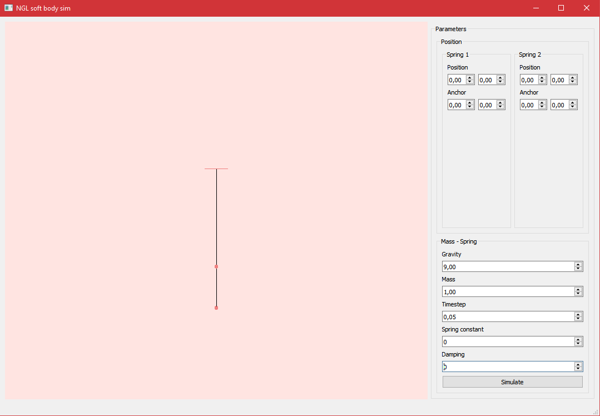

# Spring simulation
<em>
Animation Software Engineering, Bournemouth University 
Alexandra Kim Bui 
</em>

## Introduction
The spring simulator was created as a study for a Soft body simulation application. The simulator consists from two main points connected to rope using Hookes law to calculate the position. The project is written in C++ using NGL.

## Install
1. Run cmake from the created build directory.
2. Run cmake build from the build directory.

## Technical detail
The software is still developing, the parameters are still not fed into the GUI and there have to be more points created.

